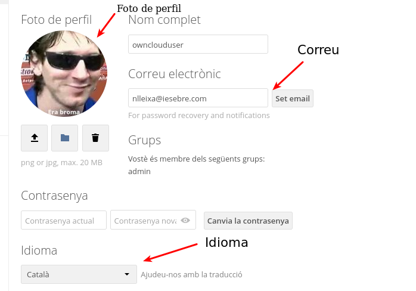
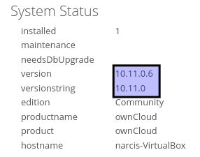

# Activitat 3

#### ***3.1-*** Llista els Virtual Hosts d'Apache per tal de veure si owncloud.XYZ.com està habilitat amb la comanda:
`apache2ctl -S`

***RESPOSTA***

--foto--

***3.2.-***  A Owncloud podem veure que hi ha una serie de carpetes per defecte, mostra la ruta real a les tres carpetes dins de la teva MV.

#### ***3.3.*** - Al directori Learn more about owncloud hi ha informació en forma de fitxers pdf. Consulta'ls i respon aquestes preguntes:

- a) Quin són els tres tipus de protecció de dades que ofereix Owncloud?
- b) Fes una petita descripció de cada un d'ells.
- c) Per quina raó ens recomana utilitzar Owncloud per als documents de Microsoft Office de la nostra empresa?
- d) Això passa a tots els països?
- e) Quina és la llicència d'OWncloud Enterprise?
- h) I la d'Owncloud Standard?
- i) Es poden veure videos en Streaming directament des de Owncloud?
- j) Es poden connectar directoris de Google Drive a Owncloud?
- k) I Dropbox?
- l) Compta Owncloud amb antivirus? En cas afirmatiu com es diu?

***RESPOSTA***

- e) Llicència comercial per als mòduls principal y Enterprise.
- h) No conté la Llicència comercial per als mòduls principal y Enterprise.
- j) Sí.
- l) Sí, es diu ClamAV.
### ***3.4.-*** Mostra els següents canvis de paràmetres d'usuari:

- a) Posa't una imatge d'usuari.
- b) Afegeix el teu mail de l'Institut.
- c) Canvia l'idioma a català.
- d) Mostra la versió d'Owncloud instal·lada.

***RESPOSTA***

- a,b,c)

- d)

